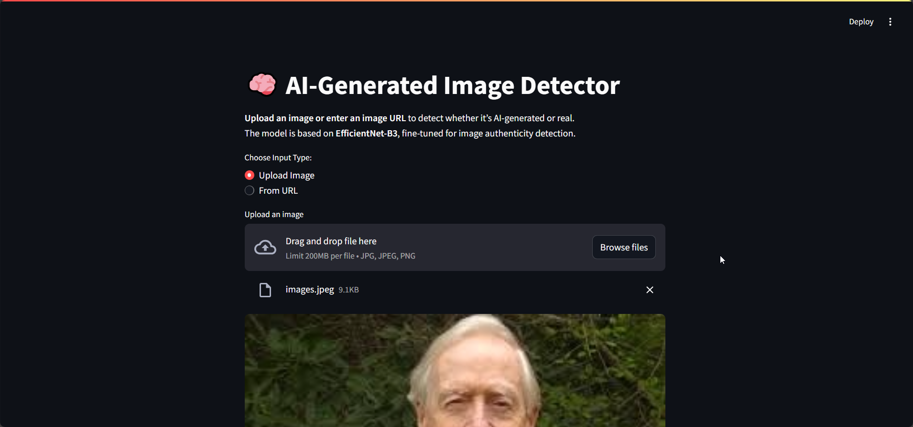

# ImageProof - AI Image Authenticity Detector 🧠

A Streamlit-based web application that uses a fine-tuned EfficientNet-B3 model to detect whether images are AI-generated or real.

## Table of Contents
- [Demo](#demo)
- [Features](#features)
- [Installation](#installation)
- [Usage](#usage)
- [Contributing](#contributing)
- [License](#license)

## Demo
Check out the application in action with these demo files:

<video controls>
  <source src="demo/demo.mp4" type="video/mp4">
</video>


------------------------


## Features
- **Image Upload**: Support for JPG, JPEG, and PNG files.
- **URL Input**: Analyze images directly from web URLs.
- **Real-time Prediction**: Instant classification with confidence scores.
- **Interactive UI**: Built with Streamlit for easy use.
- **Model Integration**: Leverages EfficientNet-B3 for accurate detection.

## Installation
To get started, clone the repository and set up a virtual environment.

```bash
# Create a virtual environment
python -m venv .venv

# Activate it
# On Linux/Mac:
source .venv/bin/activate
# On Windows:
.venv\Scripts\activate

# Install dependencies
pip install -r requirements.txt
```

## Usage
Run the application using Streamlit:

```bash
streamlit run app.py
```

1. Open the app in your browser.
2. Choose to upload an image or enter an image URL.
3. View the prediction results, including the label (AI-generated or Real) and confidence score.

Example prediction output:
- Label: 🧠 AI-generated
- Confidence: 0.95

## Contributing
Contributions are welcome! Please fork the repository and submit a pull request. Ensure code follows best practices and includes tests.

## License
This project is licensed under the MIT License - see the [LICENSE](LICENSE) file for details.

## Acknowledgements
- Built with [Streamlit](https://streamlit.io/) for the web interface.
- Model based on [EfficientNet](https://github.com/lukemelas/EfficientNet-PyTorch) and [timm](https://github.com/rwightman/pytorch-image-models).
- Thanks to the open-source community for PyTorch and related libraries.
